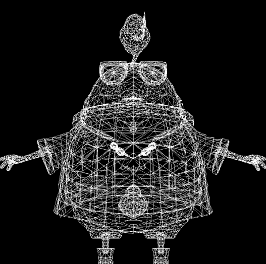

## Bresenaham's Line
看tinyrender "draw line"的部分, 处理误差的部分,  满0.5f, 减1.0f, 仔细想想其实就是四舍五入吧(x

左图是没处理误差, 右图是处理了误差, 两者区别还是挺大的(右边更对称, 更接近想要表达的直线)

除了误差处理部分, 还有就是 初始位置 的标准化=> 所有直线绘制 都是从左到右, 遍历轴取大的(max(dx,dy));  这个标准化的预处理还是非常有意义的: 1)规避了垂直时, 除数为0的情况; 2)保证了细化粒度; 3) 完成了对称检测"symmetrical"(都是从左到右draw pixels);
```c++
void Line(int x0, int y0, int x1, int y1, TGAImage& image, TGAColor color) {
    
    bool steep = false;
    if (std::abs(x1 - x0) < std::abs(y1 - y0)) {
        std::swap(x0, y0);
        std::swap(x1, y1);
        steep = true;
    }

    if (x1 < x0) {
        std::swap(x0, x1);
        std::swap(y0, y1);
    }

    
    int dx = x1 - x0;
    int dy = y1 - y0;
        
    float derror = std::abs(dy / float(dx));
    float error = 0.0f;

    int y = y0;
    for (float x = x0; x <= x1; x++) {   //  dx > dy
        if (!steep) {
            image.set(x, y, color);
        }
        else {
            image.set(y, x, color);
        }
        
        error += derror;
        if (error > 0.5f) {
            y += (y1 > y0 ? 1.0f : -1.0f);
            error -= 1.0f;
        }
    }
}
```

## Wireframe rendering
渲染线框, 唯一注意的是 .obj 的坐标是从中心开始, 因此 需要 映射到 width/2|height/2;

